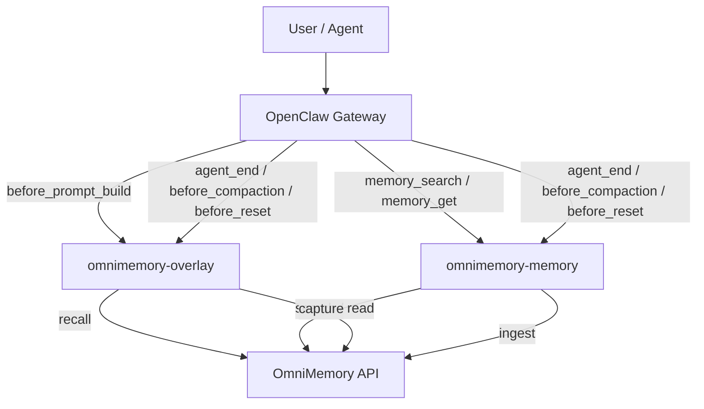

# OmniMem OpenClaw Plugin

[](https://github.com/VisMemo/OmniMem-OpenClaw-Plugin/actions/workflows/ci.yml)
[](./LICENSE)
[](#project-status)

Plug OmniMemory into OpenClaw as either a non-destructive memory overlay or a memory-slot replacement.

- English docs start here: [docs/en/getting-started.md](./docs/en/getting-started.md)
- Chinese overview: [README.zh-CN.md](./README.zh-CN.md)
- Current compatibility notes: [docs/en/replacement-compatibility.md](./docs/en/replacement-compatibility.md)

## Why This Repo Exists

This repository packages OmniMemory for OpenClaw in two product modes:

- `Overlay`
  - Adds long-term memory through plugin hooks.
  - Does not take over `plugins.slots.memory`.
  - Recommended default for most users.
- `Replacement`
  - Provides an OmniMemory-backed `kind: "memory"` slot plugin.
  - Can optionally use a compatibility patch to suppress local memory bootstrap behavior.
  - Advanced mode with stricter OpenClaw version alignment.

## Quick Start

1. Set your OmniMemory API key.

```bash
export OMNI_MEMORY_API_KEY="qbk_xxx"
```

2. Install the recommended `Overlay` mode.

```bash
git clone https://github.com/VisMemo/OmniMem-OpenClaw-Plugin.git
cd OmniMem-OpenClaw-Plugin
node scripts/omnimemory-manage.mjs install --mode overlay
```

3. Validate the installation.

```bash
npm run doctor
```

To switch to `Replacement` later:

```bash
node scripts/omnimemory-manage.mjs switch --mode replacement --apply-patch
```

## Architecture



## Choose A Mode

| Mode | Best for | Recommended |
| --- | --- | --- |
| `Overlay` | External memory augmentation without taking over OpenClaw memory internals | Yes |
| `Replacement` | Advanced users who want OmniMemory to back `memory_search` and `memory_get` directly | Only if you need memory-slot replacement |

## Project Status

Current public status:

- `Overlay` is the recommended production-facing beta path.
- `Replacement` is available, tested, and version-gated, but still positioned as an advanced workflow.
- Real OpenClaw gateway smoke and real OmniMemory smoke have both been exercised locally.
- Some upstream and backend limitations still exist. See [docs/en/limitations.md](./docs/en/limitations.md).

## Repository Layout

```text
OmniMem-OpenClaw-Plugin/
  docs/
  examples/
  plugins/
    omnimemory-overlay/
    omnimemory-memory/
  scripts/
  skills/
  src/
  test/
```

## Common Commands

```bash
npm run packages:sync
npm test
npm run test:integration
npm run doctor
npm run smoke:standard-install
npm run patch:status
```

## Documentation

- [Getting Started](./docs/en/getting-started.md)
- [Overlay Mode](./docs/en/overlay-mode.md)
- [Replacement Mode](./docs/en/replacement-mode.md)
- [Configuration](./docs/en/configuration.md)
- [Architecture](./docs/en/architecture.md)
- [Limitations](./docs/en/limitations.md)
- [Replacement Compatibility](./docs/en/replacement-compatibility.md)
- [Agent Installation](./docs/en/agent-installation.md)
- [Contribution Guide](./CONTRIBUTING.md)

## License

MIT. See [LICENSE](./LICENSE).
