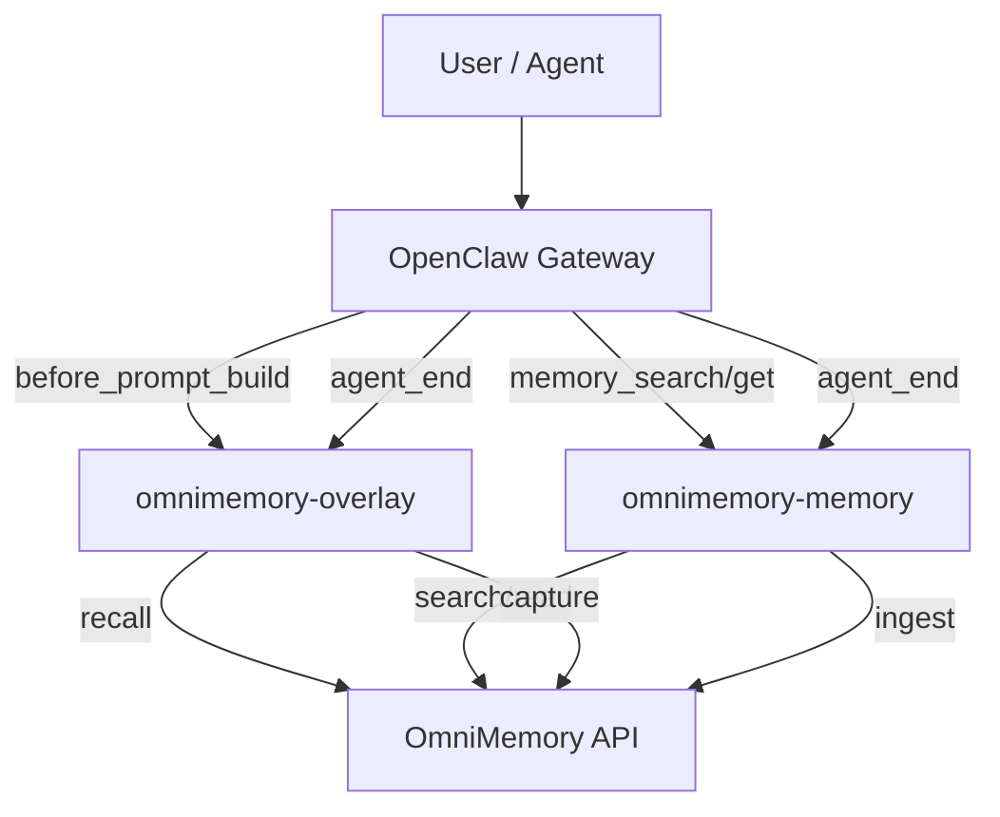

# Architecture

The repository is organized around one shared runtime and two external-facing modes.

## Design Goals

1. Keep `Overlay` non-destructive
2. Keep `Replacement` explicit and version-gated
3. Share the runtime implementation across both packages
4. Keep the OmniMemory backend separate from OpenClaw core

## Data Flow

1. OpenClaw emits hook or tool events
2. The plugin resolves scope and session context
3. OmniMemory handles retrieval or ingest
4. The plugin returns prompt guidance, tool results, or writeback status

## Scope Model

Current product policy is:

1. Tenant/account is the hard boundary
2. Recall is tenant-global
3. Ingest is session-scoped
4. Sub-agents are treated as part of the same task chain

